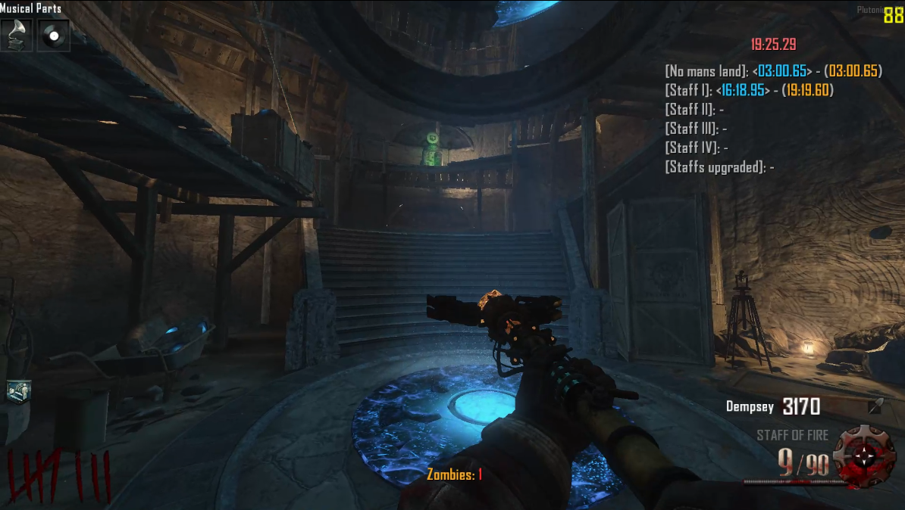

# HB Speedrun Timer (T6)

## Description

This is a GSC script that allows the user complete access to an in-game speedrun timer, includes splits.

## Make your own splits

This is a gsc script that allows the user to define and setup their own splits for speedrunning or just for tracking their time. To learn how to do this, take a look at the `src/hb_splits/origins_staffs.gsc` file, it has an example split list consisting of: opening no mans land, crafting the 4 staffs and upgrading all staffs, this file only has about 60 lines of code.

If you have any questions, bugs, feedback, advice or criticism, please contact me through one of the following media:

Plutonium Forums: `HasjBlok`
 
Discord: `mdva.`

## Upcoming features

-   N/a
